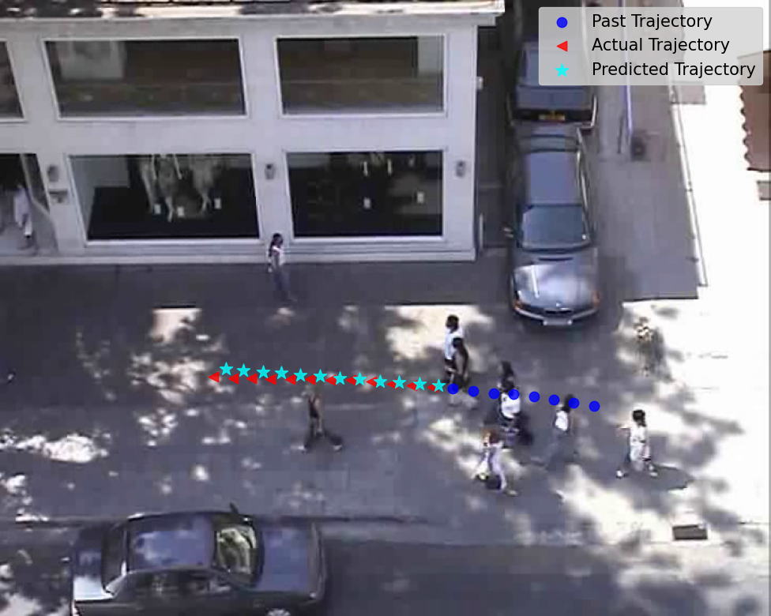

# 🧠 Project Title
Brief overview of what the repo does and why GPU acceleration matters for this work.

---

## 🚀 Prerequisites

- **NVIDIA GPU** with matching CUDA drivers (e.g. CUDA 12.1).  
- **Conda** (Miniconda or Anaconda)  
- A Linux‐native partition (e.g. `/mnt/data`) for large cache directories  
- Git

---

## 🔧 Dependency Issues & Installation Order

We encountered and resolved several cross-partition and permission hiccups. Follow this sequence exactly:

1. **System-level setup**  
   - Install NVIDIA driver and CUDA toolkit.  
   - Verify with  
     ```bash
     nvidia-smi
     nvcc --version
     ```

2. **Redirect Conda cache to Linux partition**  
   - Create a central cache location, e.g.  
     ```bash
     mkdir -p /mnt/data/conda_pkgs /mnt/data/conda_envs
     chown -R $USER:$USER /mnt/data/conda_*
     ```  
   - In `~/.condarc`, add:
     ```yaml
     pkgs_dirs:
       - /mnt/data/conda_pkgs
     envs_dirs:
       - /mnt/data/conda_envs
     ```
   - Remove any old `~/.conda` folder if present:
     ```bash
     rm -rf ~/.conda
     ```

3. **Create & activate your Conda environment**  
   ```bash
   conda create -n ai-project python=3.10 pip -y
   conda activate ai-project
   ```

4. **Install core GPU-enabled PyTorch packages first**  
   This prevents accidentally pulling CPU‐only wheels.
   ```bash
   pip install \
     torch==2.5.1+cu121 \
     torchvision==0.20.1+cu121 \
     torchaudio==2.5.1 \
     --extra-index-url https://download.pytorch.org/whl/cu121
   ```

5. **Install PyTorch Geometric (and its low-level libs) before general deps**  
   ```bash
   pip install torch-geometric==2.6.1 \
     torch-scatter torch-sparse torch-cluster torch-spline-conv \
     --no-deps
   ```

6. **Finally, install the rest of your Python dependencies**  
   ```bash
   pip install -r requirements.txt
   ```

7. **Verify GPU availability**  
   ```bash
   python - <<EOF
   import torch
   print("CUDA available:", torch.cuda.is_available())
   print("Device name:", torch.cuda.get_device_name(0))
   EOF
   ```

---

## 📦 What’s in `requirements.txt`

This file pins all non-PyTorch, non-PyTorch-Geometric libraries you need:

```text
albumentations==2.0.8
opencv-python==4.11.0.86
opencv-python-headless==4.12.0.88
timm==1.0.19
segmentation-models-pytorch==0.5.0
scikit-learn==1.7.1
pandas==2.3.0
numpy==2.2.6
matplotlib==3.10.3
pillow==11.0.0
gdown==5.2.0
huggingface-hub==0.33.2
safetensors==0.5.3
hf-xet==1.1.9
# plus any extra utils like icecream, psutil, etc.
```

For a **complete snapshot** of every installed package, see `full_environment.txt`.

---

## ⚙️ Troubleshooting

- **Permission errors on cache dirs**  
  Ensure you own `/mnt/data/conda_pkgs` and `/mnt/data/conda_envs`:  
  ```bash
  sudo chown -R $USER:$USER /mnt/data/conda_*
  ```

- **“No space left” on `/home`**  
  All conda packages and environments now live on `/mnt/data`.

- **Pip cache too large**  
  You can relocate pip’s cache by setting:
  ```bash
  export XDG_CACHE_HOME=/mnt/data/pip_cache
  mkdir -p $XDG_CACHE_HOME
  ```

- **Fallback to CPU**  
  If CUDA isn’t found, the code will default to `device='cpu'`. Inspect logs for mismatched CUDA versions.

---

## 🏃‍♂️ Running the Code

```bash
python main.py --config configs/your_config.yaml
```

All GPU logic is handled by:
```python
device = torch.device('cuda:0' if torch.cuda.is_available() else 'cpu')
```

---

## 🤝 Contributing & License

- PRs welcome—please open an issue first.  
- Licensed under MIT.  

---

With these explicit steps and the two environment files (`requirements.txt` for essentials, `full_environment.txt` for a 1:1 snapshot), anyone should be able to reproduce your exact setup. Let me know if you’d like adjustments or an installation script!

# ASTRA: A Scene-aware TRAnsformer-based model for trajectory prediction
This is the official PyTorch implmentation of the paper **ASTRA: A Scene-aware TRAnsformer-based model for trajectory prediction**.

## Model Architecture 🏗️

<p align="center"></p>

## Table of Contents 📋
- [ASTRA: A Scene-aware TRAnsformer-based model for trajectory prediction](#astra-a-scene-aware-transformer-based-model-for-trajectory-prediction)
  - [Model Architecture 🏗️](#model-architecture-️)
  - [Table of Contents 📋](#table-of-contents-)
  - [Getting Started 🚀](#getting-started-)
    - [Environment](#environment)
    - [Installation](#installation)
  - [Repository Structure 📂](#repository-structure-)
  - [Download \& Process Datasets](#download--process-datasets)
  - [Download Pretrained Models](#download-pretrained-models)
  - [Training](#training)
  - [Evaluation](#evaluation)
  - [Visualizations 📊](#visualizations-)
  - [Results 📈](#results-)
  - [Citation 📖](#citation-)

## Getting Started 🚀
### Environment
- Tested OS: Linux
- Python >= 3.9
- PyTorch == 2.0
### Installation
  1. Clone the repository to your local machine.
  2. Navigate to the project directory: `cd ASTRA`
  3. Create the environment and install the requirements using `source scripts/build_env_data_process.sh`

## Repository Structure 📂
The repository is structured as follows:

```
📦 ASTRA
 ┣ 📂 configs
 ┃ ┣ 📜 eth.yaml
 ┃ ┗ 📜 pie.yaml
 ┣ 📂 data
 ┣ 📂 datasets
 ┃ ┣ 📂 eth_ucy
 ┃ ┗ 📂 PIE
 ┣ 📂 models
 ┃ ┣ 📜astra_model.py
 ┃ ┗ 📜keypoint_model.py
 ┣ 📂 scripts
 ┣ 📂 utils
 ┣ 📂 visualization
 ┃ ┣ 📜 gradcam_visualizer_ETH.ipynb
 ┃ ┣ 📜 gradcam_visualizer_PIE.ipynb
 ┃ ┣ 📜 traj_visualizer_ETH.ipynb
 ┃ ┗ 📜 traj_visualizer_PIE.ipynb
 ┣ 📜 main.py
 ┣ 📜 train_ETH.py
 ┣ 📜 train_PIE.py 
 ┗ 📜 README.md (You are here!)
```

## Download & Process Datasets
> **ETH-UCY Dataset (Bird's Eye View (BEV))**
* Download ETH dataset, videos and annotations, and process them using:
```bash
bash ./scripts/down_process_eth.bash
```

> **PIE Dataset (Ego Vehicle View (EVV))**
* Download PIE dataset, videos and annotations, and process them using:
```bash
bash ./scripts/down_process_PIE.bash
```

* The datasets will be downloaded so that its structure is like the one shown above.

## Download Pretrained Models
* Download pretrained U-Net Keypoint Embedding model using:
```bash
bash ./scripts/down_pretrained_unet_models.bash
``` 
*(downloads pretrained unet weights in folder: `./pretrained_unet_weights/`. By default, these pretrained weights are used in training the ASTRA model)*

* Download pretrained ASTRA models using:
```bash
bash ./scripts/down_pretrained_astra_models.bash
```
*(downloads pretrained ASTRA model weights in folder: `./pretrained_astra_weights/`)*

## Training 
> **ETH-UCY Dataset (BEV)**

To train the model on ETH dataset, run the following command:
```
python main.py --config_file ./configs/eth.yaml
```
*(NOTE: The above command will train the model on **eth** subset. To train on other subsets, please change the config file accordingly.)*

**OPTIONAL**: Pretraining U-Net based Keypoint Embedding model 
*By default, the U-Net based Keypoint Embedding model loads the pretrained embedding weights from `'./pretrained_unet_weights/eth_unet_model_best.pt` but if you want to pretrain the U-Net based Keypoint Embedding model, run the following command:*
```
python ./scripts/pretrain_unet_eth.py
```


> **PIE Dataset (EVV)**

To train the model on PIE dataset, run the following command:
```
python main.py --config_file ./configs/pie.yaml
```

**OPTIONAL**: Pretraining U-Net based Keypoint Embedding model 
*By default, the U-Net based Keypoint Embedding model takes the pretrained embedding weights from `'./pretrained_unet_weights/pie_unet_model_best.pt` but if you want to pretrain the U-Net based Keypoint Embedding model, run the following command:*
```
python ./scripts/pretrain_unet_pie.py
```

## Evaluation
To ensure reproducibility, we have provided the pretrained models in `./pretrained_astra_weights/` folder. 
> **ETH-UCY Dataset (BEV)**
* To evaluate the downloaded pretrained models on ETH dataset, run the following command:
```python
python test_ETH.py --config_file ./configs/eth.yaml
```

> **PIE Dataset (EVV)**
* To evaluate the downloaded pretrained models on PIE dataset, run the following command:
```python
python test_PIE.py --config_file ./configs/pie.yaml
```

## Visualizations 📊
<p align="center">
    
</p>
<table align="center" style="width:100%; table-layout:fixed;">
    <tr>
        <td></td>
        <td></td>
    </tr>
</table>

* Grad-CAM Visualizers are available at:
  * `./visualization/gradcam_visualizer_ETH.ipynb`
  * `./visualization/gradcam_visualizer_PIE.ipynb`
* Trajectory Visualizers are available at:
  * `./visualization/traj_visualizer_ETH.ipynb`
  * `./visualization/traj_visualizer_PIE.ipynb`

## Results 📈
| Dataset | ADE   | FDE   | CADE | CFDE  | ARB   | FRB   |
|---------|-------|-------|------|-------|-------|-------|
| ETH     | 0.47  | 0.82  | N/A  | N/A   | N/A   | N/A   |
| HOTEL   | 0.29  | 0.56  | N/A  | N/A   | N/A   | N/A   |
| UNIV    | 0.55  | 1.00  | N/A  | N/A   | N/A   | N/A   |
| ZARA1   | 0.34  | 0.71  | N/A  | N/A   | N/A   | N/A   |
| ZARA2   | 0.24  | 0.41  | N/A  | N/A   | N/A   | N/A   |
| PIE     | N/A   | N/A   | 9.91 | 22.42 | 18.32 | 17.07 |


## Citation 📖

If you find this repository useful for your research, please consider giving a star ⭐ and a citation

```
@inproceedings{,
    title={},
    author={},
    booktitle={},
    year={}
}
```
